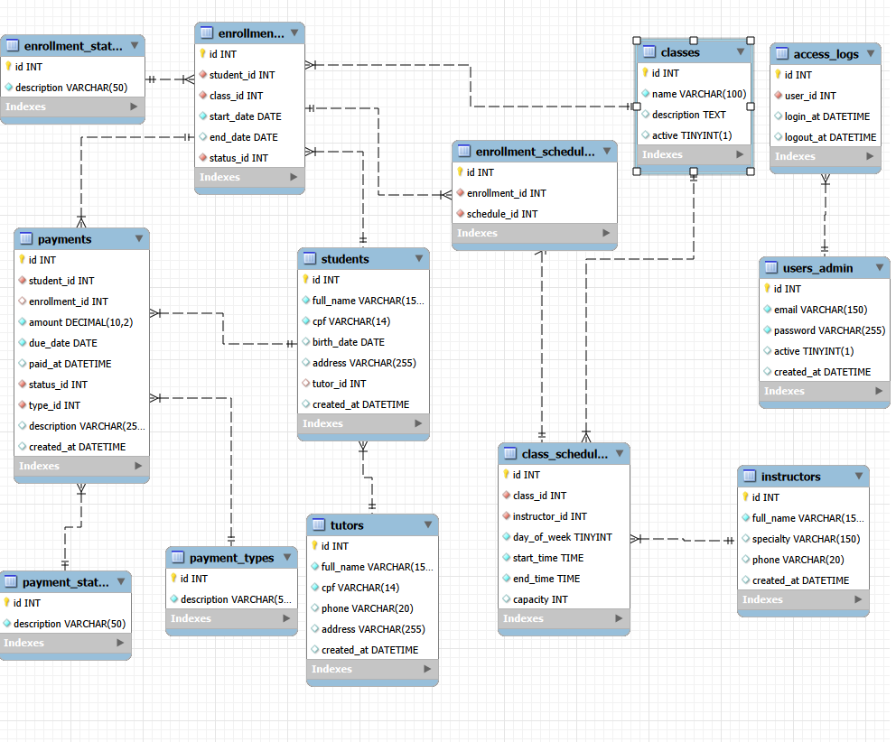

# 🎲 Modelagem do Banco de Dados

📚 `classes` (tipo da aula)

Ex: 
- Hidroginástica
- Natação infantil

⏱️ `class schedules`

Ex: 
- Segunda 19h
- Quarta 10h

# 🔗 Estruturas

**Relações:**

- 1 usuário -> N logs de acesso
- 
- 1 aula -> N horários
- 1 instrutor -> pode estar em vários horários
- **_Regra importante:_** não pode haver dois horários no mesmo dia/hora.
- 1 tutor -> N alunos 
- 1 aluno -> 0 ou 1 tutor (se menor)
- N alunos -> N aulas (tabela intermediária)

# Script Base

- [Arquivo de Script](./modelo_criacoes_do_banco_e_tabelas.sql)

# DER (Diagrama de Entidade-Relacionamento)

