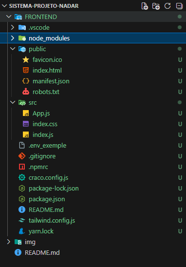

# Projeto Nadar - FrontEnd

Criação do _frontend_, fazendo uso do comando: `npx create-react-app projeto-nadar`, realizando a higienização das pastas, deixando o projeto pronto para começar a desenvolver a página de _login_.

## Rodando o projeto

Assim que baixar, abrir o projeto no VsCode (ou no editor de sua preferência) e no terminal, rodar o comando: `yarn install`, para que seja instalado todas as suas dependências e possamos utilizar o projeto.

Caso não tenha instalado o gerenciador de pacote _Yarn_, no terminal, digitar o seguinte comando: `npm install --global yarn`. 

Para checar se está instalado o gerenciador de pacotes, no terminal, digitar `yarn -v`, se for apresentando uma versão está instalado, caso contrário, precisa instalar.

Após rodar o _yarn_ na pasta _FrontEnd_, será criado a pasta **_node_modules_**. Com isso, o gerenciador de pacote já instaladou o conteúdo da pasta, para poder utilizar. Recomendando instalar as extesões para ter uma melhor utilização do projeto.

Após instalar as extensões o projeto estiver pronto para startar, basta digitar no terminal, dentro do diretório _frontend_, o comando: `yarn dev`. E será aberto uma página do navegador, com o projeto iniciado.

## Extensões

Na pasta .vscode, tem as extensões recomendadas, para utilizar o projeto. Com o arquivo `extensions.json`, após baixar o projeto base, ir na parte de extesões direto no VS code, e na aba **RECOMMENDED** e instalar o que for listado ali, sendo elas, as mesmas que estão no arquivo _extensions_.
You can learn more in the [Create React App documentation](https://facebook.github.io/create-react-app/docs/getting-started).