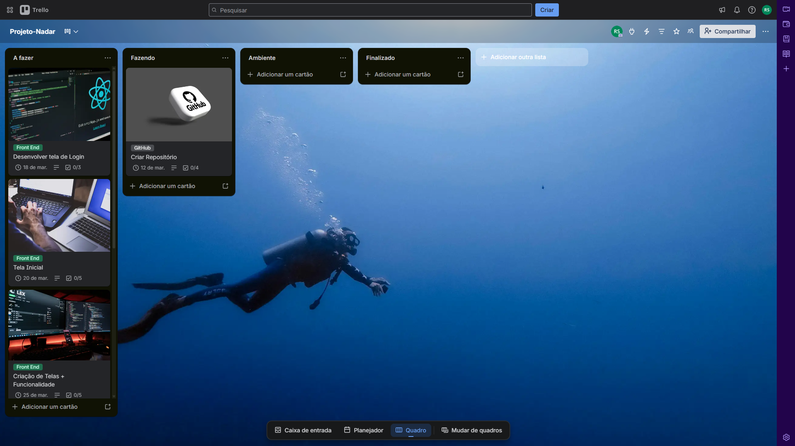

# 📚 Sumário

- [Sobre o Projeto](#-projeto-nadar)
- [Objetivo do Projeto](#-objetivo-do-projeto)
- [Problemas que o Sistema Resolve](#-problemas-que-o-sistema-resolve)
- [Funcionalidades Planejadas](#-funcionalidades-planejadas)
- [Stack Tecnológica](#️-stack-tecnológica)
- [Arquitetura do Projeto](#-arquitetura-do-projeto)
- [Planejamento do Projeto](#-planejamento-do-projeto)
- [Melhorias Futuras](#-melhorias-furutas)
- [Objetivo Educacional](#-objetivo-educacional)
- [Autor do projeto](#-autor)

---

# 🏊 **Projeto nadar**

Sistema de gerenciamento de alunos e alunas para academia de natação.

O **Projeto-Nadar** é uma aplicação full stack, desenvolvida para auxiliar a academia no controle de alunos, turmas, aulas e pagamentos, centralizando informações e facilitando a gestão administrativa. 

Este projeto está sendo desenvolvido como parte de um estudo prático de arquitetura **Full Stack**, utilizando tecnologias modernas do ecossistema _JavaScript_.

---

# 📌 Objetivo do Projeto

Muitas academias prquenas ainda realizam o controle de alunos utilizando **planilhas, cadernos ou sistemas pouco integrados.**

O **Projeto Nadar** busca resolver esse problema oferecendo uma plataforma que permita: 

- Cadastro e gerenciamento de alunos
- Controle de turmas e horários
- Gestão de professores
- Registro de aulas
- Controle de presença
- Upload de documentos ou fotos
- Organização centralizada das informações da academia

---

# 🧠 Problemas que o Sistema Resolve

Academias frequentemente enfrentam dificuldades como: 

- Falta de controle centralizado de alunos
- Dificuldade em organizar turmas e horários
- Falta de histórico de aulas
- Controle manual de presença
- Processos administrativos lentos

O sistema busca **automatizar e organizar essas rotinas**, aumentando a eficiência da gestão.

--- 

# 🚀 Funcionalidades Planejadas 

## Gestão de Alunos
- Cadastro de alunos
- Atualização de dados
- Upload de foto do aluno
- Histórico de aulas

## Gestão de Turmas
- Criação de turmas
- Associação de alunos às turmas
- Definição de horários

## Gestão de Professores
- Cadastro de professores
- Associação com turmas

## Controle de Aulas
- Registro de aulas realizadas
- Controle de presença

## Autenticação
- Login seguro utilizando JWT
- Controle de acesso por usuário

---

# 🛠️ Stack Tecnológica

## Frontend

- React.js
- Vite
- Axios
- React Hook Form
- TailwindCss

## Backend

- Node.js
- Express
- JWT Authentication
- Multer (uplod de imagens)

## Banco de Dados 

- MySQl

## Desktop

- Electron.js (geração de executável `.exe`)

---

# 🧱 Arquitetura do Projeto 

O projeto seguirá uma arquitetura **Full Stack desacoplada**, com frontend e backend separados.

---

# 📋 Planejamento do Projeto

O desenvolvimento será realizado utilizando **metodologia de sprints**, com organização das tarefas através do _Trello_.

As etapas incluem:

1. Planejamento do sistema
2. Estruturação do repositório
3. Desenvolvimento do Frontend
4. Desenvolvimento da API Backend
5. Integração Frontend + Backend
6. Teste
7. Empacotamento Desktop com Electron 

---

# 🔮 Melhorias Furutas

Algumas funcionalidades planejadas para versões futuras incluem:

- Dashboard administrativo
- COntrole de mensalidades
- Integração com pagamentos
- Relatórios de presença
- Aplicação mobile
- Notificações automáticas
- Controle financeiro da academia

---

# 🎯 Objetivo Educacional 

Este projeto também tem como objetivo: 

- Praticar desenvolvimento **Full Stack**
- Aplicar boas práticas de arquitetura 
- Trabalhar com **API REST**
- Utilizar autenticação com **JWT**
- Integrar **React + Node + MySQL**
- Criar uma aplicação desktop com **Electron**
- Entregar esse sistema para a academia como forma de trabalho voluntário

---

# 👨‍💻 Autor

Desenvolvido por **Rodrigo da Silva Sousa**